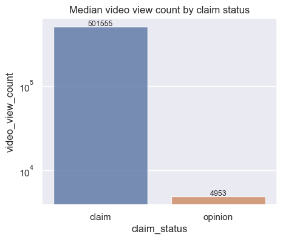
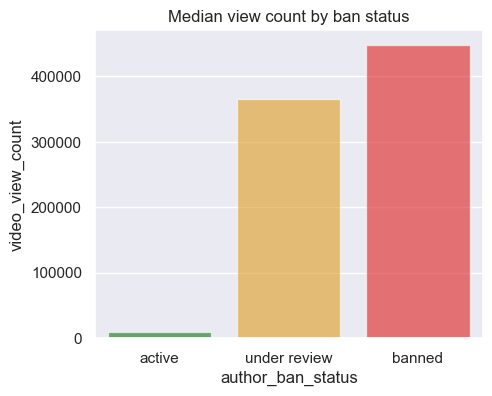

# TikTok Claims Classification: Mitigating Misinformation

## Project Overview
The goal of this project is to develop a machine learning model that assists TikTok's data team in classifying user-submitted videos as either "claims" or "opinions." By accurately identifying claims, the platform can prioritize them for human review, helping to mitigate the spread of misinformation.

**[Read the Executive Summary for Stakeholders](reports/Executive_Summary.md)**

## Project Workflow
### 1. Exploratory Data Analysis (EDA) & Data Cleaning
Notebook: [01_Exploratory_Data_Analysis.ipynb](01_Exploratory_Data_Analysis.ipynb)

In this phase, I conducted a deep dive into a dataset of ~19,000 videos to understand the relationship between engagement metrics and claim status. For a full breakdown of the variables used in this project, see the [Data dictionary](data_dictionary.md).

**Key Findings:**

- The dataset is well-balanced: 50.3% claims and 49.7% opinions, meaning a random guess would only be 50% accurate.

- Engagement is a Key Predictor: Claim videos generate significantly higher views, likes, shares, and downloads compared to opinion videos.

- Videos by "Banned" authors show higher engagement per view when flagged as claims.

### 2. Feature Engineering & Machine Learning
Notebook: [02_Machine_Learning_Classifier_vectorized.ipynb](02_Machine_Learning_Classifier_vectorized.ipynb)

Building on the EDA, I developed a classification model to automate the claim detection process.

Feature Engineering: 
- Extracted text_length from video transcriptions.

- Utilized CountVectorizer to transform transcription text into numerical features.

Modeling Strategy: Evaluated Random Forest and XGBoost models using a 60/20/20 train/validation/test split.

**Results:**

The Random Forest model was selected as the champion model.

The model achieved high recall, successfully minimizing False Negatives (claims incorrectly flagged as opinions). The "cost" of missing a claim is higher than the "cost" of accidentally flagging an opinion.

Feature Importance: Engagement metrics (views, likes, shares) remained the strongest predictors, while text-based features had less predictive power. Text-based features (transcription) were included via Vectorization but were secondary to engagement behavior.

##  Tech Stack
- Languages: Python (Pandas, NumPy)
- Frameworks: Scikit-Learn, XGBoost
- Feature Engineering: CountVectorizer (NLP), Text Length Extraction.
- Validation: 60/20/20 Train/Validation/Test split to ensure the model generalizes to new, unseen data.
- To run this notebook locally, please refer to the [requirements.txt](requirements.txt) for environment dependencies.

## Key Insights for Stakeholders
- Engagement Patterns: High engagement is the primary "red flag" for potential claims on the platform.

- Efficiency: The automated model can significantly reduce the manual workload for content moderators by pre-classifying nearly half of the incoming content (opinions) with high confidence.

## Strategic Recommendations
- Automated Filtering: Immediately route all "opinion" classifications to a lower priority queue to optimize human resources.

- Engagement Triggers: Implement "High-Engagement Alerts." Since views and shares are strong predictors of claims, any video showing a rapid spike in these metrics should be auto-flagged for review.

- Refining Text Analysis: While engagement is currently the strongest signal, future iterations should explore sentiment analysis to see if the tone of the claim adds more predictive value.