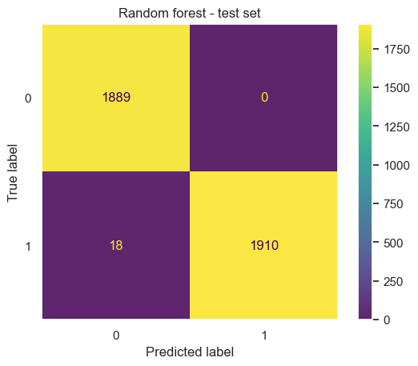

# 🛡️ TikTok Claims Classification: Executive Summary
Status: Ready for Production Implementation

Objective: Develop a machine learning system to categorize user-generated content as "claims" or "opinions" to prioritize high-risk videos for human moderation.

## The Problem
TikTok receives too many daily uploads for humans to check every video manually. Misinformation usually spreads through "claims" rather than "opinions," but the current moderation system treats all videos the same.

* Moderators currently spend about 50% of their time looking at "opinion" videos that do not need fact-checking, which puts a high strain on resources.
* Claim videos get much higher views and shares than opinions, which means misinformation spreads faster than it can be caught.
* Human moderation alone cannot keep up with the volume of claims, opinions, and unverified content without help from technology.

## The Insight
The best way to tell if a video is a "claim" is not by analyzing the text, but by looking at how the audience reacts to it.
* We found that user behavior is a stronger predictor than text, as video view, like, and share counts were the most important indicators.
* In this project, a "False Negative" is a dangerous failure, so I tuned the Random Forest Champion Model for high recall to keep the platform safe.

  

## Strategic Recommendations
To turn these findings into a working safety tool, I recommend the following:
* Use the Random Forest model to automatically move "opinion" videos to a lower priority, which will double the moderation team's capacity.
* Set "Velocity Triggers" to create alerts when a video gets likes and views very quickly, flagging it for review regardless of the content.
* Watch "Banned" authors more closely because their claim videos often get higher engagement-per-view.

## Business Impact
This system can make moderation 50% more efficient by filtering out low-risk "opinion" content. This lets human moderators focus on the most important videos and reduces the time it takes to stop misinformation.